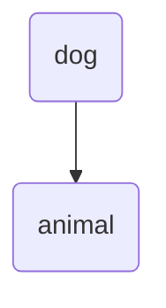
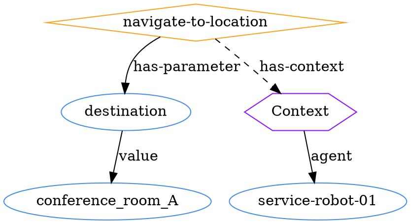
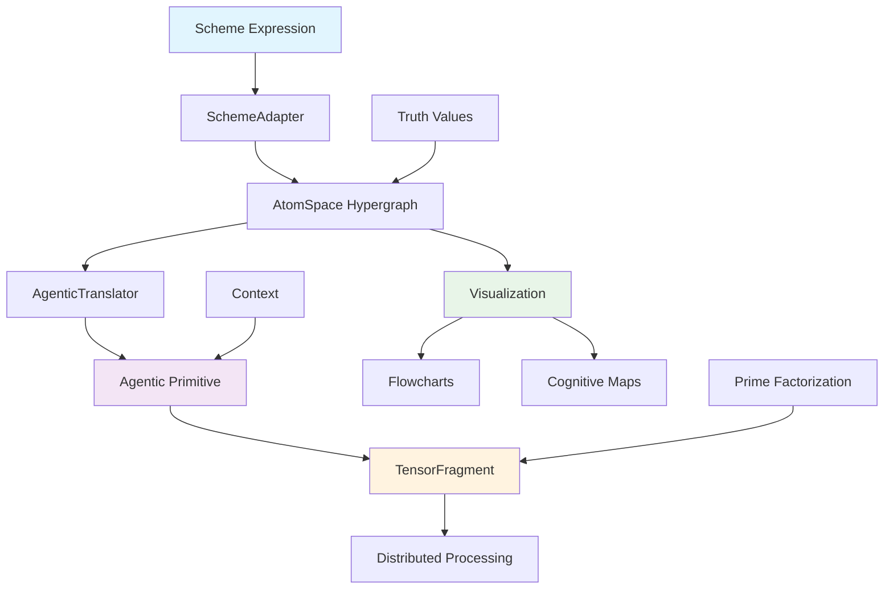

# Hypergraph Visualization Examples

This document demonstrates the visualization capabilities of the Cognitive Grammar Microservices framework.

## Basic Usage

```typescript
import { createCognitiveSystem } from '@/lib/cognitive';

const { atomSpace, schemeAdapter, agenticTranslator, visualizer } = createCognitiveSystem();
```

## Example 1: Simple Inheritance Visualization

```typescript
// Create simple inheritance relationship
const dog = atomSpace.createNode(AtomType.CONCEPT_NODE, 'dog');
const animal = atomSpace.createNode(AtomType.CONCEPT_NODE, 'animal');
const inheritance = atomSpace.createLink(AtomType.INHERITANCE_LINK, [dog, animal]);

// Visualize the hypergraph
const visualization = visualizer.visualizeAtoms([dog, animal, inheritance], 'Animal Inheritance');

// Export as Mermaid flowchart
const mermaid = visualizer.exportFlowchart(visualization, 'mermaid');
console.log(mermaid);
```

**Output Mermaid:**


## Example 2: Agentic Primitive Visualization

```typescript
// Define a navigation primitive
const navigationPrimitive: AgenticPrimitive = {
  action: 'navigate-to-location',
  parameters: {
    destination: 'conference_room_A',
    path_planning: 'shortest',
    obstacle_avoidance: true,
    max_speed: 2.5,
  },
  context: {
    agent: 'service-robot-01',
    goal: 'attend-meeting',
    constraints: ['avoid-crowds', 'quiet-operation'],
    resources: ['lidar', 'camera', 'wheel-motors'],
  },
};

// Visualize the agentic primitive
const agenticViz = visualizer.visualizeAgenticPrimitive(navigationPrimitive);

// Export as DOT format for Graphviz
const dot = visualizer.exportFlowchart(agenticViz, 'dot');
console.log(dot);
```

**Output DOT:**


## Example 3: Tensor Fragment Visualization

```typescript
import { TensorFragmentUtils } from '@/lib/cognitive';

// Create a tensor fragment for visual processing
const visualShape = TensorFragmentUtils.createShape(
  3,   // RGB vision modality
  15,  // Deep visual processing depth
  200, // Rich visual context
  400, // High visual salience
  30   // Moderate autonomy
);

const tensorFragment = atomSpace.createTensorFragment(visualShape);
const tensorViz = visualizer.visualizeTensorFragment(tensorFragment!);

// Export as JSON for programmatic use
const json = visualizer.exportFlowchart(tensorViz, 'json');
const parsed = JSON.parse(json);

console.log('Tensor Fragment Nodes:', parsed.nodes.length);
console.log('Tensor Fragment Edges:', parsed.edges.length);
```

## Example 4: Complete Cognitive Pipeline Visualization

```typescript
// 1. Start with Scheme expression
const schemeExpression = '(perform-action "navigate" (target "kitchen") (method "walking"))';

// 2. Parse to hypergraph
const parseResult = schemeAdapter.parseScheme(schemeExpression);
const atomsResult = schemeAdapter.schemeToAtoms(parseResult.result!);

// 3. Convert to agentic primitive
const agenticPrimitive: AgenticPrimitive = {
  action: 'navigate',
  parameters: {
    target: 'kitchen',
    method: 'walking',
  },
};

// 4. Create tensor representation
const tensorShape = TensorFragmentUtils.createShape(1, 5, 50, 80, 25);
const tensorFragment = atomSpace.createTensorFragment(tensorShape);

// 5. Visualize each stage
const stages = [
  { name: 'Hypergraph', viz: visualizer.visualizeAtoms(atomsResult.result!, 'Parsed Atoms') },
  { name: 'Agentic', viz: visualizer.visualizeAgenticPrimitive(agenticPrimitive) },
  { name: 'Tensor', viz: visualizer.visualizeTensorFragment(tensorFragment!) },
];

// 6. Generate comprehensive report
const report = VisualizationUtils.generateSystemReport(atomsResult.result!, [tensorFragment!]);
console.log(report);
```

## Example 5: System Architecture Overview

```typescript
// Generate the cognitive architecture flow diagram
const flowDiagram = VisualizationUtils.createCognitiveFlowDiagram();
console.log(flowDiagram);
```

**Output:**


## Example 6: Round-Trip Translation Visualization

```typescript
// Test round-trip translation with visualization
const originalPrimitive: AgenticPrimitive = {
  action: 'pick-and-place',
  parameters: {
    object_id: 'cup_001',
    grasp_type: 'precision_pinch',
    pickup_location: [0.5, 0.3, 0.1],
    place_location: [0.8, 0.3, 0.1],
  },
};

// Perform round-trip test
const roundTripResult = agenticTranslator.roundTripTest(originalPrimitive);

// Visualize the results
const originalViz = visualizer.visualizeAgenticPrimitive(originalPrimitive);
const hypergraphViz = visualizer.visualizeAtoms(roundTripResult.intermediate as any[], 'Intermediate Hypergraph');
const finalViz = visualizer.visualizeAgenticPrimitive(roundTripResult.final!);

console.log('Round-trip validity:', roundTripResult.isValid);
console.log('Total loss:', roundTripResult.lossMetrics?.totalLoss);

// Export all stages for comparison
const stages = [
  { stage: 'Original', mermaid: visualizer.exportFlowchart(originalViz, 'mermaid') },
  { stage: 'Hypergraph', mermaid: visualizer.exportFlowchart(hypergraphViz, 'mermaid') },
  { stage: 'Final', mermaid: visualizer.exportFlowchart(finalViz, 'mermaid') },
];

stages.forEach(({ stage, mermaid }) => {
  console.log(`\n${stage} Stage:\n${mermaid}`);
});
```

## Configuration Options

```typescript
// Customize visualization appearance
const customVisualizer = new HypergraphVisualizer({
  maxNodes: 25,                    // Limit complexity
  maxEdges: 50,                    // Limit edges
  showTruthValues: true,           // Show confidence values
  showTensorDetails: false,        // Hide tensor internals
  colorScheme: 'cognitive',        // Use cognitive color scheme
  layout: 'hierarchical',          // Force hierarchical layout
  groupSimilarNodes: true,         // Group by type
});

// Use custom configuration
const customViz = customVisualizer.visualizeAtoms(atoms, 'Custom Visualization');
```

## Export Formats

The visualization system supports multiple export formats:

1. **Mermaid** - For documentation and GitHub README files
2. **DOT** - For Graphviz rendering
3. **JSON** - For programmatic processing
4. **SVG Description** - For custom SVG generation

```typescript
const formats: FlowchartFormat[] = ['mermaid', 'dot', 'json', 'svg-description'];

formats.forEach(format => {
  const output = visualizer.exportFlowchart(visualization, format);
  console.log(`${format.toUpperCase()}:\n${output}\n`);
});
```

## Integration with Web Applications

```typescript
// For React components
import { HypergraphVisualizer } from '@/lib/cognitive';

function CognitiveVisualization({ atoms }: { atoms: Atom[] }) {
  const visualizer = new HypergraphVisualizer();
  const viz = visualizer.visualizeAtoms(atoms);
  const mermaid = visualizer.exportFlowchart(viz, 'mermaid');
  
  return (
    <div>
      <h3>{viz.metadata.title}</h3>
      <pre>{mermaid}</pre>
      <p>Complexity: {viz.metadata.complexity}</p>
      <p>Nodes: {viz.metadata.nodeCount}, Edges: {viz.metadata.edgeCount}</p>
    </div>
  );
}
```

## Performance Considerations

- Set appropriate `maxNodes` and `maxEdges` limits for large systems
- Use `groupSimilarNodes: true` for better layout of complex graphs
- Consider `layout: 'force-directed'` for highly connected graphs
- Enable `showTruthValues: false` for cleaner simple visualizations

## Use Cases

1. **Debugging Cognitive Systems** - Visualize atom relationships and transformation steps
2. **Documentation** - Generate flowcharts for technical documentation
3. **Educational Materials** - Show cognitive processing pipelines
4. **System Monitoring** - Real-time visualization of cognitive state
5. **Research** - Analyze cognitive architecture patterns

This visualization framework provides comprehensive tools for understanding and communicating the structure and behavior of cognitive systems built with the Distributed Agentic Cognitive Grammar Network.